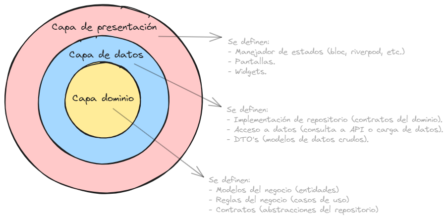
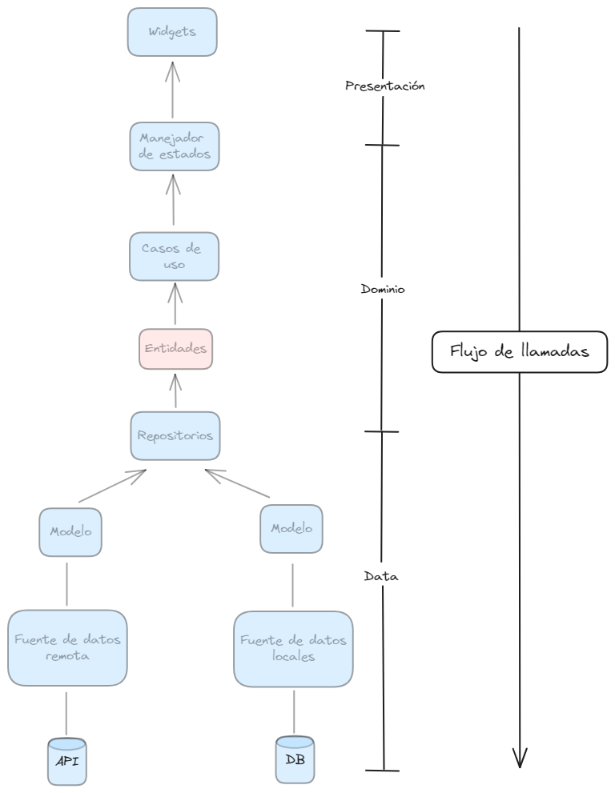

# Clean Architecture.

> Es básicamente un enfoque utilizado para diseñar software donde se aplica un concepto denominado **separación de responsabilidades**. La idea central de este concepto es que nuestra aplicación esté diseñada de tal manera que el código quede dividido en capas concéntricas donde exista una capa central que sirva de base para la construcción de las demás capas.

## Gráficamente.


## Explicación de cada una de las capas.

### Capa de dominio.
Esta es la capa más interna y es la encargada de **definir los modelos de negocio** (denominados **entidades**) que representan a objetos que son utilizadas en el nivel más alto de la aplicación, **definir las reglas de negocio** (denominadas casos de uso) que se encargan de encapsular toda la lógica del negocio y **definir contratos** que serán posteriormente implementados en la capa de datos.

### Capa de datos.
Esta es la capa intermedia y depende de la capa de dominio. Ésta capa es la encargada de **implementar los contratos definidos en la capa de dominio** (indicar cómo se accederán a los datos ya que en la capa de dominio se define la acción pero no los pasos para ello), **definir el acceso a los datos** (conjunto de pasos para realizar la petición a una API o cargar datos almacenados localmente) y **definir los modelos de datos** (estos son utilizados para comunicarse de manera eficiente con las distintas fuentes de datos). 

### Capa de presentación.
Esta es la capa más externa de la arquitectura limpia y es la encargada de **definir las pantallas**, **definir los widgets** (componentes más moleculares como botones, formularios, etc.) y **gestionar el manejo de estado** (en este punto podemos referirnos a cualquiera de los distintos gestores de estados que podamos encontrar en el lenguaje de programación que estemos utilizando). 

## Representación de las interacciones.


> Cuando los componentes visuales de nuestra aplicación son llamados estos invocan al gestor de estado para que le proporcione la información que debe ser visualizada en pantalla. Aquí, el gestor de estados debe invocar al caso de uso correspondiente a la vista en cuestión y este a su vez desemboca en acciones que invocan a los contratos definidos en la capa de dominio que utiliza las implementaciones definidas en la capa de acceso a los datos para cargar los datos ya sea por medio de una petición a una API o de la carga de datos que se encuentran almacenados localmente.

## Organización de carpetas.

### Organización basada en features.
```markdown
📁 lib/
|-- 📁 features/
|   |-- 📁 example_feature/
|   |   |-- 📁 data/
|   |   |   |-- 📁 data_sources/
|   |   |   |   |-- 📁 local/
|   |   |   |   |    |-- 📄 example_local_data_source.dart
|   |   |   |   |    |-- 📄 local.dart //export file
|   |   |   |   |-- 📁 remote/
|   |   |   |   |    |-- 📄 example_remote_data_source.dart
|   |   |   |   |    |-- 📄 remote.dart //export file
|   |   |   |   |-- 📄 data_sources.dart //export file
|   |   |   |-- 📁 enums/
|   |   |   |   |-- 📄 example_enum.dart
|   |   |   |   |-- 📄 enums.dart //export file
|   |   |   |-- 📁 models/
|   |   |   |   |-- 📄 example_model.dart
|   |   |   |   |-- 📄 models.dart //export file
|   |   |   |-- 📁 repositories/
|   |   |   |   |-- 📄 example_repository.dart
|   |   |   |   |-- 📄 repositories.dart //export file
|   |   |   |-- 📁 utils/ (not use in this case)
|   |   |   |   |-- 📄 example_utils.dart
|   |   |   |   |-- 📄 utils.dart //export file
|   |   |   |-- 📄 data.dart //export file
|   |   |-- 📁 domain/
|   |   |   |-- 📁 entities/
|   |   |   |   |-- 📄 example_entity.dart
|   |   |   |   |-- 📄 entities.dart //export file
|   |   |   |-- 📁 repositories/
|   |   |   |   |-- 📄 example_repository.dart
|   |   |   |   |-- 📄 repositories.dart //export file
|   |   |   |-- 📁 use_cases/
|   |   |   |   |-- 📄 example_use_case.dart
|   |   |   |   |-- 📄 use_cases.dart //export file
|   |   |   |-- 📄 domain.dart //export file
|   |   |-- 📁 presentation/
|   |   |   |-- 📁 bloc
|   |   |   |   |-- 📁 bloc_folder
|   |   |   |   |   |-- 📄 ..._bloc.dart
|   |   |   |   |   |-- 📄 ..._event.dart
|   |   |   |   |   |-- 📄 ..._state.dart
|   |   |   |   |-- 📁 other_bloc_folder
|   |   |   |-- 📄 bloc.dart //export file
|   |   |   |-- 📁 enums
|   |   |   |   |-- 📄 example_enum.dart
|   |   |   |   |-- 📄 enums.dart //export file
|   |   |   |-- 📁 helpers
|   |   |   |   |-- 📄 example_helper.dart
|   |   |   |   |-- 📄 helpers.dart //export file
|   |   |   |-- 📁 screens/
|   |   |   |   |-- 📁 example_screen/
|   |   |   |   |   |-- 📄 example_screen.dart
|   |   |   |   |-- 📄 screens.dart //export file
|   |   |   |-- 📁 widgets/
|   |   |   |   |-- 📄 example_widget.dart
|   |   |   |   |-- 📄 widgets.dart //export file
|   |   |   |-- 📄 presentation.dart //export file
|   |   |-- 📄 example_feature.dart
|   |-- 📁 other_example_feature/
|   |   |-- // same folders
|   |   |-- 📄 other_example_feature.dart
|-- 📁 core/
|   |-- 📁 widgets/
|   |-- |-- 📁 atomic_design/ //this is a comp pattern
|   |-- 📁 injection/
|   |   |-- 📄 register_clients.dart
|   |   |-- 📄 register_data_sources.dart
|   |   |-- 📄 register_repositories.dart
|   |   |-- 📄 register_services.dart
|   |   |-- 📄 register_use_cases.dart
|   |   |-- 📄 service_locator.dart //init all registers
|   |-- 📁 network/
|   |   |-- 📁 clients/
|   |   |   |-- 📁 dio
|   |   |   |   |-- 📄 dio_client.dart
|   |   |   |   |-- 📄 dio.dart //export file 
|   |   |   |-- 📄 clients.dart //export file
|   |   |-- 📁 exceptions/ //to have more control over error handling
|   |   |-- 📁 interceptors/ //connectivity or others
|   |-- 📁 observers/
|   |   |-- 📄 custom_bloc_observer.dart
|   |   |-- 📄 custom_navigator_observer.dart
|   |   |-- 📄 observers.dart
|   |   |-- 📄 injection.dart
|   |-- 📁 providers/
|   |   |-- 📄 bloc_provider.dart
|   |   |-- 📄 providers.dart //export file
|   |-- 📁 errors/
|   |   |-- 📄 failure.dart
|   |   |-- 📄 errors.dart //export file
|   |-- 📁 utils/
|   |   |-- 📄 constants.dart // or any other for core section
|   |   |-- 📄 utils.dart //export file
|   |-- 📁 config/
|   |   |-- 📁 config1/
|   |   |-- 📁 config2/
|   |   |-- 📄 config.dart //export file
|   |-- 📁 routers/
|   |   |-- 📄 feature1_router.dart
|   |   |-- 📄 feature2_router.dart
|   |   |-- 📄 compose_router.dart //put the routers together
|   |   |-- 📄 routers.dart //export file
|   |-- 📁 extensions/ //any extension we need
|   |   |-- 📄 string_extensions.dart
|   |   |-- 📄 datetime_extensions.dart
|   |   |-- 📄 extensions.dart //export file
|   |-- 📁 themes/
|   |   |-- 📄 themes.dart //export file
|   |-- 📁 services/
|   |   |-- 📄 shared_preferences_service.dart
|   |   |-- 📄 services.dart //export file
|   |-- 📄 core.dart //export file
|-- 📄 app.dart
|-- 📄 bootstrap.dart
|-- 📄 main.dart
```

> Existen también otras organizaciones de carpetas como por ejemplo las basadas en **capas** y también basadas en **dominio**.
> [Ejemplo de cada una](https://github.com/weincoder/arquitectura_referencia_flutter/tree/main/Clean_arch_2023_examples).

